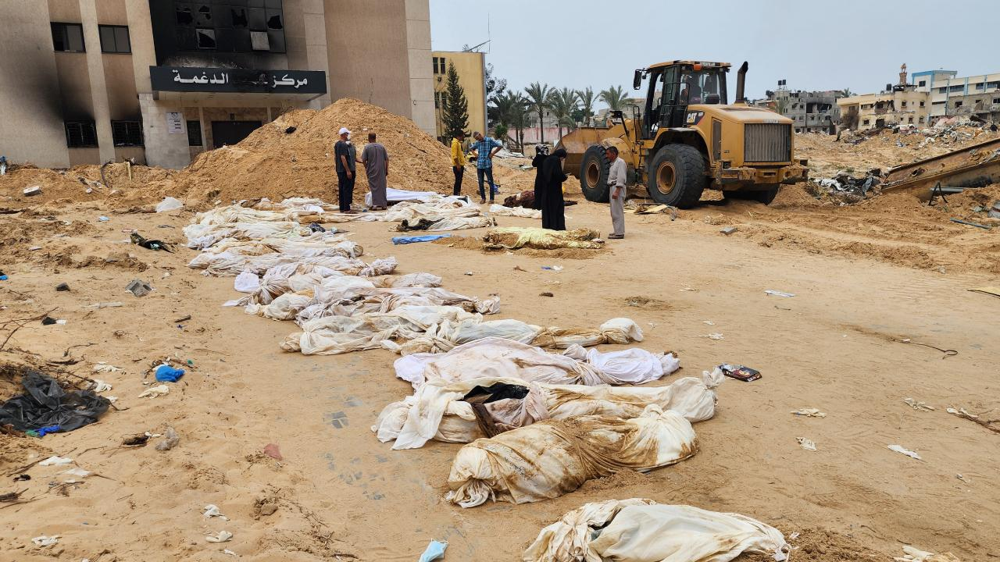

# Etnik temizliği durdurmak için yapabileceklerimiz

Cenevre merkezli Avrupa-Akdeniz İnsan Hakları İzleme Örgütü (Euro-Med), İsrail'in ablukası altındaki Gazze'de düzenlenen saldırılarda hayatını kaybedenlerin gömüldüğü 130'dan fazla toplu mezar belgelediklerini bildirdi.

[Gazze'deki toplu mezarlar ne anlatıyor?](https://www.trthaber.com/haber/dunya/gazzedeki-toplu-mezarlar-ne-anlatiyor-853902.html)

## Bilinçlenme

### Terimlerin Doğrularını öğrenmeliyiz

Yanlış kullanılan terimlerin doğrularını öğrenmeliyiz.

### Etnik budama örnekleri

#### Balkanlar

Balkanlardaki Türkler Türkiye'ye sürgüne zorlamıştır.

#### Suriye

PKK/PYD/YPG terör örgütleri, Suriye'de etnik gruplara yönelik baskılar ve zulümler gerçekleştirmiştir.

Türkiye, terörle mücadele kapsamında PKK/PYD/YPG'ye karşı operasyonlar düzenlemiştir ve bu örgütlerin Suriye'deki etnik gruplara yönelik eylemlerini engellemeye çalışmaktadır

PKK/PYD/YPG terör örgütleri, Suriye'de Türkmenler de dahil olmak üzere çeşitli etnik gruplara karşı zulüm ve baskı uygulamıştır. Bu örgütler, Suriye'deki etnik gruplara karşı saldırgan eylemlerde bulunmuş ve bölgede istikrarsızlığa neden olmuştur

## İsrail Soykırım Davası

Güney Afrika, İsrail'i Gazze'deki Filistin halkına karşı soykırım yapmakla suçlayarak [Uluslararası Adalet Divanı](https://www.mfa.gov.tr/uluslararasi-adalet-divani.tr.mfa)'na şikayette bulundu.

Bu şikayette, İsrail'in eylemlerinin ve ihmallerinin özel bir kasıtla işlenen soykırım niteliğinde eylemler olduğunu, Gazze’deki Filistinlileri daha geniş bir Filistin ulusal, ırksal ve etnik grubunun bir parçası olarak yok etmek niyeti güttüğünü, İsrail’in devlet organları, devlet görevlileri ve onun talimatları veya onun yönlendirmesi, kontrolü altında hareket eden diğer kişi ve kuruluşlar aracılığıyla Gazze’deki Filistinlilerle ilgili olarak Soykırım Sözleşmesi kapsamındaki yükümlülüklerini ihlal ettiğini belirtmişti.

### Suçlama

Güney Afrika, İsrail’i, 1948 tarihli BM Soykırımın Önlenmesi ve Cezalandırılması Sözleşmesi'ni üç şekilde ihlal etmekle suçluyor.

1. İsrail’in, Gazze’de yürüttüğü operasyonlarda, aynı ulusa, ırka ve dine mensup Gazze halkına karşı soykırım maksadıyla öldürme, ciddi surette bedensel veya zihinsel zarar verme güdüsüyle hareket ettiğini ve Gazzelilerin yaşam şartlarını, fiziksel varlığını ortadan kaldıracak şekilde kasten değiştirdiğini iddia ediyor.
2. İsrail’in soykırımı önlemede başarısız olduğu ifade ediliyor.
3. Güney Afrika, İsrail’in soykırımı teşvik eden yetkilileri cezalandırmadığına işaret ediyor.

Güney Afrika, İsrail’i, Gazze Şeridi’nde Hamas’la savaş bahanesiyle “soykırım” yapmakla suçlayarak Uluslararası Adalet Divanı’na şikayette bulundu. Bu şikayette, Gazze Şeridi’ndeki operasyonları uluslararası hukukun artan ilgisinin odağı haline gelen Tel Aviv yönetiminin Güney Afrika, Uluslararası Adalet Divanı’ndan, İsrail’in Soykırım Sözleşmesi kapsamındaki yükümlülüklerini ihlal ettiği iddiasıyla başvurmuştu.

Güney Afrika, İsrail’i, Gazze’de Filistinlilere karşı yürüttüğü eylemlerle İsrail’in Soykırım Sözleşmesi kapsamındaki yükümlülüklerini ihlal ettiği iddiasıyla Uluslararası Adalet Divanı’na başvurmuştu. Başvurusunda, İsrail’in eylemlerinin ve ihmallerinin özel bir kasıtla işlenen soykırım niteliğinde eylemler olduğunu, Gazze’deki Filistinlileri daha geniş bir Filistin ulusal, ırksal ve etnik grubun bir parçası olarak yok etmek niyeti güttüğünü, İsrail’in devlet organları, devlet görevlileri ve onun talimatları veya onun yönlendirmesi, kontrolü altında hareket eden diğer kişi ve kuruluşlar aracılığıyla Gazze’deki Filistinlilerle ilgili olarak Soykırım Sözleşmesi kapsamındaki yükümlülüklerini ihlal ettiğini belirtmişti.

Güney Afrika, İsrail’i, Gazze’de Filistinlilere karşı soykırım yapmakla suçlayarak Uluslararası Adalet Divanı’na şikayette bulundu. Bu şikayette, İsrail’in eylemlerinin ve ihmallerinin özel bir kasıtla işlenen soykırım niteliğinde eylemler olduğunu, Gazze’deki Filistinlileri daha geniş bir Filistin ulusal, ırksal ve etnik grubun bir parçası olarak yok etmek niyeti güttüğünü, İsrail’in devlet organları, devlet görevlileri ve onun talimatları veya onun yönlendirmesi, kontrolü altında hareket eden diğer kişi ve kuruluşlar aracılığıyla Gazze’deki Filistinlilerle ilgili olarak Soykırım Sözleşmesi kapsamındaki yükümlülüklerini ihlal ettiğini belirtmişti.

Güney Afrika, İsrail’i, Gazze’de Filistinlilere karşı soykırım yapmakla suçlayarak Uluslararası Adalet Divanı’na şikayette bulundu. Bu şikayette, İsrail’in eylemlerinin ve ihmallerinin özel bir kasıtla işlenen soykırım niteliğinde eylemler olduğunu, Gazze’deki Filistinlileri daha geniş bir Filistin ulusal, ırksal ve etnik grubun bir parçası olarak yok etmek niyeti güttüğünü, İsrail’in devlet organları, devlet görevlileri ve onun talimatları veya onun yönlendirmesi, kontrolü altında hareket eden diğer kişi ve kuruluşlar aracılığıyla Gazze’deki Filistinlilerle ilgili olarak Soykırım Sözleşmesi kapsamındaki yükümlülüklerini ihlal ettiğini belirtmişti.

Güney Afrika, İsrail’i, Gazze’de Filistinlilere karşı soykırım yapmakla suçlayarak Uluslararası Adalet Divanı’na şikayette bulundu. Bu şikayette, İsrail’in eylemlerinin ve ihmallerinin özel bir kasıtla işlenen soykırım niteliğinde eylemler olduğunu, Gazze’deki Filistinlileri daha geniş bir Filistin ulusal, ırksal ve etnik grubun bir parçası olarak yok etmek niyeti güttüğünü, İsrail’in devlet organları, devlet görevlileri ve onun talimatları veya onun yönlendirmesi, kontrolü altında hareket eden diğer kişi ve kuruluşlar aracılığıyla Gazze’deki Filistinlilerle ilgili olarak Soykırım Sözleşmesi kapsamındaki yükümlülüklerini ihlal edi

---

[Başvurunun tamamı](/pdf/south-africa-court-aplication-en.pdf)'nı okuyun

## Sürekli Boykot

[Boykot Neden Gerekli](/boykot/)

## Protesto Gösterileri ve Kampanyalar

ABD Başkanı Joe Biden'ın da katıldığı Beyaz Saray Muhabirleri Derneği Yemeği sırasındaki Filistin protestoları.

[Protestoları internette ara](https://duckduckgo.com/?q=filistin+protestolar%C4%B1&t=newext&atb=v423-1&df=w&ia=web)

### Amerikan üniversitede kampüsleri

<video controls src="./img/uni-texas.mp4" title="Title"></video>

Filistin'e destek veren öğrencilerin eylemleri, ABD'deki birçok üniversitede geniş kapsamlı protestolara yol açmıştır. Öğrenciler, üniversitelerin Filistin insan hakları için tavır almasını, savaştan kar eden şirketlerden çekilme taleplerini ve üniversite yatırımları hakkında şeffaflık istemektedir.

Protestolar genellikle üniversitelerin özgürlüklerini desteklemesiyle birlikte, okul politikalarını ihlal ettiklerini iddia ettikleri kamp kurmalarına karşı sert bir tavır almışlardır. Bu protestoların bazıları sırasında yüzlerce kişi gözaltına alınmış, örneğin Northeastern Üniversitesi'nde yaklaşık 100 kişi tutuklanmıştır. Ayrıca, California State Polytechnic University, Humboldt Üniversitesi ve diğer bazı üniversitelerde de benzer eylemler gerçekleşmiştir.

Öğrenciler, barış çağrısında bulunmakta ve Filistin'deki devam eden soykırıma karşı protesto etmektedirler.

## Medya ve Uluslararası Örgütler

Medya ve uluslararası insan hakları örgütlerine yapılacak çağrılar hiç bir işe yaramamaktadır.

### Medya şirketleri siyonistlerin kontrolündedir.

Yahudi siyonistlerin medya ve sinemadaki etkinliği incelendiğinde, Ekme Kuramı, Gündem Belirleme Yaklaşımı,
Suskunluk Sarmalı gibi diğer kitle iletişim modellerinin de geçerli olduğu örnekler görmek mümkündür.

Türkçe yayınlanan Yahudi Shalom Gazetesi konu hakkında şöyle yazmıştır:
_“Medyanın bir ülkenin ekonomik, kültürel, politik, entellektüel ve hatta sosyal hayatını da etkilediğini düşünürsek,
ABD’nin çok satan üç gazetesinden ikisi olan The Wall Street Journal ve The New York
Times’ın sahiplerinin, reytingi yüksek dünyaca ünlü sitcom ve dizilerinin yapımcı, yönetmen
ve yazarlarının yüzde 58’inin, ABC, NBC ve CBS gibi televizyon kanalı sahiplerinin Yahudi
asıllı olması, ABD’li Yahudilerin, özellikle günde televizyonları ortalama 6 saat 47 dakika
açık kalan Amerikan toplumu üzerindeki etkisi küçümsenemez."_

### Televizyon Sektörü

Fox TV Kanalları Ağı, ABD’de 22 TV Kanalı, çok sayıda kablo TV
ağı, Hong Kong, Latin Amerika ve Hindistan uydu yayınları, Japon Z ve Hint V line uydu
kanallarının %50 hissesi, Avustralya’da yedi TV networku, Dünya çapında düzinelerce uydu
istasyonu.

---

**Kaynaklar:**

[YAHUDİ DİASPORASI İLETİŞİM STRATEJİSİ: ABD ÖRNEĞİ](/pdf/oemer-yetkin-yahudi-diasporasi-iletisim-stratejisi.pdf)

[1] https://www.aa.com.tr/tr/dunya/uzmanlar-guney-afrikanin-israile-karsi-actigi-soykirim-davasindaki-delillerini-guclu-buluyor/3102986

[2] https://www.trthaber.com/haber/dunya/guney-afrikanin-israile-actigi-soykirim-davasindaki-aktorler-827983.html

[3] https://www.indyturk.com/node/688856/g%C3%BCney-afrikan%C4%B1n-i%CC%87sraili-uluslararas%C4%B1-adalet-divan%C4%B1na-%C5%9Fikayeti-ne-anlama-geliyor

[4] https://www.setav.org/israile-karsi-soykirim-davasinda-onleyici-tedbir-karari/

[5] https://www.change.org/p/g%C3%BCney-afrika-n%C4%B1n-i%CC%87srail-e-kar%C5%9F%C4%B1-uluslararas%C4%B1-adalet-divan%C4%B1-nda-a%C3%A7t%C4%B1%C4%9F%C4%B1-davay%C4%B1-destekleyin

[6] https://www.bbc.com/turkce/articles/ce9ep3w12xqo
[7] https://www.indyturk.com/node/685611
[8] https://www.aa.com.tr/tr/dunya/guney-afrikanin-israile-karsi-actigi-soykirim-davasina-destek-aciklamalari-hizla-artiyor/3105824
